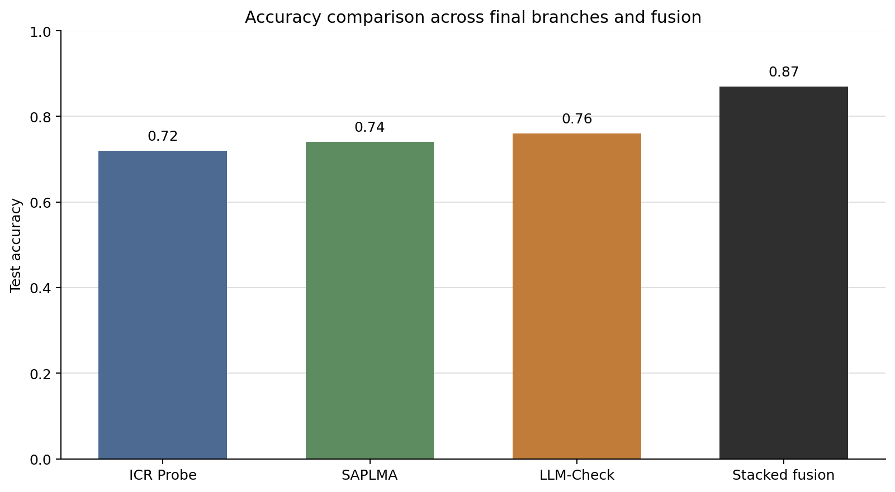
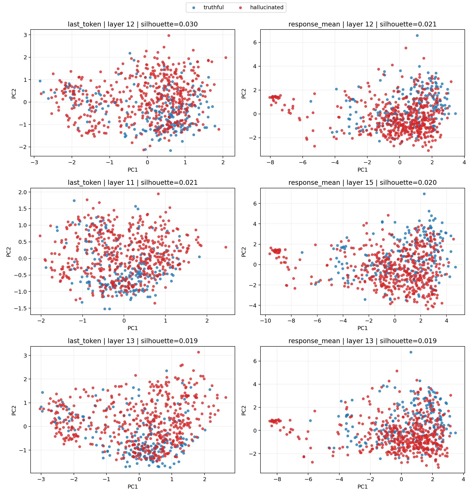
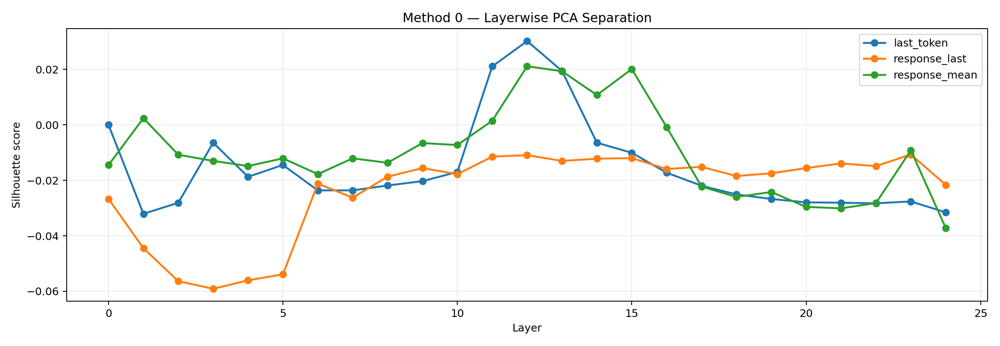

# Solution

## Report Overview

This document is a submission report for the provided hallucination-detection task. 

The report should be read from the start with the following framing:

- Final solution: `LLM_check`, adapted from `LLM-Check: Investigating Detection of Hallucinations in Large Language Models`, with best observed accuracy `0.78` (avg_mean_accuracy 0.76).
- Promising solution number 2: a 3-head fusion model (custom architecture) that combines 3 approaches: `LLM_check`, `SAPLMA` from `The Internal State of an LLM Knows When It's Lying`, and `ICR Probe` from `ICR Probe: Tracking Hidden State Dynamics for Reliable Hallucination Detection in LLMs`, with accuracy `0.73`.

Mentioned papers were analyzed and some ideas were adapted for the initial task provided.

## Core Papers Used

- `LLM-Check: Investigating Detection of Hallucinations in Large Language Models` — G Sriramanan, S Bharti et al.: this is the main paper behind the final `LLM_check` solution. I adapted its response-level uncertainty and hidden-state geometry ideas to the Qwen2.5-0.5B pipeline used in this repository. 3-head model also contains this branch.
- `The Internal State of an LLM Knows When It's Lying` — Amos Azaria, Tom Mitchell: this paper motivated the SAPLMA-style single-hidden-state probe used here as one branch inside the secondary fusion model.
- `ICR Probe: Tracking Hidden State Dynamics for Reliable Hallucination Detection in LLMs` — Zhenliang Zhang, Xinyu Hu et al.: this paper motivated the hidden-state dynamics and consistency features used here as the ICR branch inside the secondary fusion model.

## Reproducibility

This repository now exposes two runnable probe configurations: `--llm-check` or `--fusion`.

```bash
pip install -r requirements.txt
python solution.py --llm-check
```

This is the final submitted solution. It runs the `LLM_check` classifier and writes:

```text
results.json
predictions.csv
```

`results.json` stores cross-validation metrics on `data/dataset.csv`. `predictions.csv` stores the final labels for `data/test.csv`.

The repository also includes `ablation_results.json`. It contains the ablation experiments for the `LLM_check` family and the selected `best_config` used to justify the final `LLM_check` design.

Configuration `--fusion` runs the 3-head fusion architecture. It is retained as a promising solution number 2, but it is not the main final solution in this submission.

Plain `python solution.py` defaults to `--llm-check`.

## Components

`aggregation.py` extracts one 947-dimensional vector from a single Qwen2.5-0.5B forward pass:

```text
896 SAPLMA features
24  ICR features
27  LLM_check features
947 total features
```

`probe.py` now supports two explicit modes:
- `--llm-check`: use only the 27-dimensional `LLM_check` feature block.
- `--fusion`: train the 3-head stacked model over SAPLMA, ICR, and `LLM_check`.

The only change applied to `solution.py` is that it now parses `--llm-check` and `--fusion` flags and keeps `LLM_check` as the default path. 

`splitting.py` defines the stratified folds and validation subsets used by the fixed evaluation pipeline. 

`Run_Colab.ipynb` exposes the same switch for Colab execution for using Google GPUs.

## Final Solution: `LLM_check`

The final released solution in code is `LLM_check`. It achieved the best accuracy in my experiments:

```text
LLM_check accuracy = 0.76
```

The important reason for promoting `LLM_check` to the final solution is that it gives the strongest metric while staying mathematically compact. On a dataset with only 689 labelled examples, this matters. The final classifier uses only 27 features and one logistic regression model, which is easier to regularize than a multi-head neural ensemble.

### 1. Input Representation

For each sample, the model processes the concatenated sequence:

```text
prompt + response
```

Using the ChatML marker `<|im_start|>assistant\n`, the code identifies the response span
`[s, e)`. All `LLM_check` features are computed only on response tokens.

Let the response contain `m = e - s` tokens, and let `z_t` be the logits at position `t`.

### 2. Logit Features

The released code computes three logit-based quantities.

First, it measures how probable the generated response tokens are under the model:

```text
ell_t = log softmax(z_(t-1))[x_t]
perplexity = exp(-(1 / m) * sum_t ell_t)
```

This is the standard autoregressive next-token score restricted to the response span.

Second, for each response position the code computes an entropy-like statistic over the full vocabulary distribution:

```text
p_t(v) = softmax(z_t)_v
E_t = -(1 / |V|) * sum_v p_t(v) log p_t(v)
window_entropy = max_t E_t
```

The implementation uses the maximum response-window value. This captures the most uncertain point in the answer (`window_entropy = token_entropy.max()`).

Third, the code keeps only the top-`k` logits with `k = 50`, renormalizes them, and computes an averaged top-`k` entropy:

```text
q_t = softmax(topk(z_t, k))
topk_entropy = -(1 / (m k)) * sum_t sum_i q_t(i) log q_t(i)
```

These three values form the uncertainty block:

```text
u(x) in R^3
```

### 3. Hidden-State Geometry Features

For each transformer layer `l`, let

```text
H_l in R^(m x d)
```

be the matrix of response-token hidden states, where `d = 896`.

The released code centers each token vector by subtracting its hidden-dimension mean:

```text
H~_l = H_l - mean_hidden_dim(H_l)
```

Then it forms a response-token Gram matrix:

```text
Sigma_l = H~_l H~_l^T + alpha I
alpha = 1e-3
```

The scalar geometry score for layer `l` is:

```text
g_l = mean_i log sigma_i(Sigma_l)
```

where `sigma_i(Sigma_l)` are the singular values of `Sigma_l`.

This is the most important mathematical part of the final solution. Instead of using one token vector, it summarizes the geometry of the entire response trajectory inside each layer. If a hallucinated answer forms a different spectral structure than a supported answer, this score changes.

Because Qwen2.5-0.5B has 24 transformer layers, the code produces:

```text
g(x) = [g_1, g_2, ..., g_24] in R^24
```

### 4. Final `LLM_check` Feature Vector

The complete final feature vector is:

```text
phi_LLM_check(x) = [u(x), g(x)] in R^27
```

or explicitly,

```text
phi_LLM_check(x) =
[perplexity, window_entropy, topk_entropy, g_1, ..., g_24]
```

### 5. Final Classifier

The classifier used in the released code is:

```text
StandardScaler -> LogisticRegression(penalty="l1", solver="saga", C=10)
```

Mathematically, if `x' = StandardScaler(phi_LLM_check(x))`, then:

```text
P(y = 1 | x) = sigmoid(w^T x' + b)
```

and the training objective is L1-regularized logistic loss:

```text
min_(w,b) sum_i BCE(sigmoid(w^T x'_i + b), y_i) + lambda ||w||_1
```

The L1 penalty is important here. It keeps the effective model sparse and reduces variance on a small dataset.

### Why `LLM_check` Worked Best

The final solution uses the smallest hypothesis class among the tested models while still preserving response-level information. In practice, `LLM_check` worked best for three connected reasons:

1. It uses all response tokens, not just one token (despite it being common to use only the last_response token).
2. It uses spectral geometry across layers, not only raw hidden activations.
3. It keeps the classifier simple enough to avoid fitting the noise of a small dataset.

This is why I define `LLM_check` as the final solution of the repository.

### LLM_check Ablation Record

The file `ablation_results.json` records the ablation study for the `LLM_check` method family. It compares:

```text
logit
hidden
attns
logit_hidden
logit_attns
hidden_attns
logit_hidden_attns
```

using `mean_val_accuracy` as the selection metric.

The selected `best_config` in `ablation_results.json` file is:

```text
name         = logit_hidden__logistic_regression
feature_set  = logit_hidden
feature_dim  = 27
classifier   = logistic
```

with:

```text
mean_val_accuracy  = 0.7923
mean_test_accuracy = 0.7590
```

This ablation result is important for the report because it confirms that the strongest `LLM_check` variant for this task is the compact 27-dimensional `logit + hidden` configuration used in the final code, while attention-family additions were explored but not selected as the final method.

## Promising Solution Number 2: 3-Head Fusion

The 3-head architecture is still implemented and runnable through:

```bash
python solution.py --fusion
```

but I now define it as promising solution number 2 rather than the final solution.

Its measured accuracy was lower than `LLM_check`:

```text
Fusion accuracy = 0.734
```

### Fusion Architecture

The fusion model uses three branch probabilities:

```text
p_ICR(x), p_LLM_check(x), p_SAPLMA(x)
```

and a logistic regression stacker:

```text
P(y = 1 | x) =
sigmoid(w0 + w1 p_ICR(x) + w2 p_LLM_check(x) + w3 p_SAPLMA(x))
```

The branches are:

- `SAPLMA`: an MLP over the last real token from layer 15 (was empirically chosen using PCA method, see explanation further).
- `ICR`: an MLP over 24 Jensen-Shannon consistency scores between residual updates and masked attention distributions.
- `LLM_check`: the 27-dimensional feature model described above.

The stacker is trained on out-of-fold branch predictions. Even with this precaution, the fusion system has substantially more trainable capacity than `LLM_check` alone:

- two neural branch heads,
- one sparse logistic branch head,
- one meta-logistic regression,
- threshold tuning on validation data.

With only 689 labelled samples, this architecture tend to overfit. That matches the observed result: it is more complex, but it does not beat the simpler `LLM_check` solution.

## Papers and Concepts Used

| Paper or concept | Role in this repository | Main idea used here |
|---|---|---|
| `LLM-Check: Investigating Detection of Hallucinations in Large Language Models` | Final solution | Response-level spectral geometry and logit uncertainty |
| `The Internal State of an LLM Knows When It's Lying` | Used inside promising solution number 2 | Single hidden-state probing |
| `ICR Probe: Tracking Hidden State Dynamics for Reliable Hallucination Detection in LLMs` | Used inside promising solution number 2 | Attention / residual consistency across layers |
| Geometry of Truth | Diagnostic only | PCA-style inspection of truthfulness structure in hidden states |

## Experiments and Failed Attempts

### Geometry of Truth

I used Geometry of Truth only as a diagnostic method. It did not become part of the final classifier because the separation was weak for this task. 

However, that diagnostic was still useful. It supported the choice of the last token and layer 15 for the auxiliary SAPLMA branch used in the fusion baseline.

### Why the Fusion Model Was Not Chosen as Final

The original report version described the 3-head stack as the final system. After reviewing the actual metrics, that framing is not correct. The strongest result comes from `LLM_check`, not from the full fusion model. Therefore:

- Final solution: `LLM_check` with accuracy `0.76`
- Promising solution number 2: 3-head fusion with accuracy `0.734`

This new framing is closer to the empirical result and also closer to the bias-variance tradeoff of the task.

## Final Accuracy Diagram



## Diagnostic Plots

The following plots belong to the diagnostic Geometry of Truth experiments and were not used directly as the final detector:





## Notes on Colab

This solution requests hidden states, logits, and attentions from Qwen2.5-0.5B in the same forward pass. That is memory intensive, so `solution.py` keeps `BATCH_SIZE = 1`.

`Run_Colab.ipynb` now exposes both runnable modes:

```text
--llm-check   final released solution
--fusion      promising solution number 2
```
